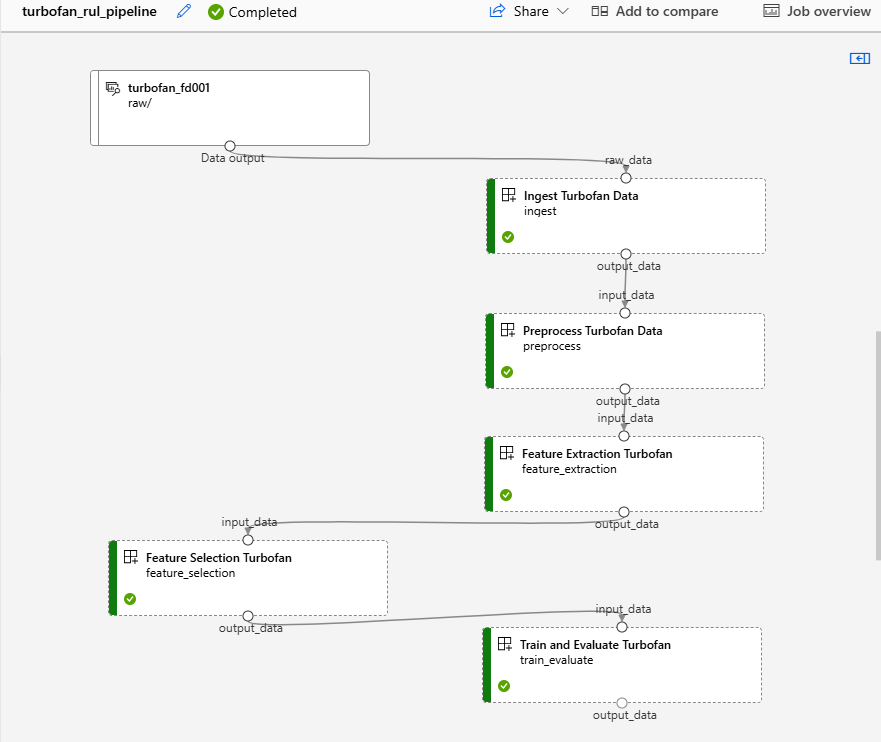

# DSAI3202
**Maymona Mustafa, 60306027**

---

# Lab 5 — DSAI3202: Scalable Feature Extraction and Selection for Predictive Maintenance

---

## Objective
Build a complete end-to-end predictive maintenance pipeline using the NASA C-MAPSS turbofan engine dataset. Raw multivariate sensor time-series data is transformed into meaningful features using tsfresh, then reduced from 777 to 8 features using filter-based methods and a Genetic Algorithm (DEAP). The final selected features are used to train regression models that predict the Remaining Useful Life (RUL) of each engine.

---

## Tools & Technologies
- Git & GitHub
- Python (pandas, scikit-learn, tsfresh, deap, xgboost, lightgbm)
- NASA C-MAPSS Turbofan Dataset (FD001)
- Azure Machine Learning (Components, Pipelines, Compute)
- Azure ML CLI 

---

## Project Structure
```bash
60306027-Cloud_Win-26/
├── components/
│   ├── ingest/
│   │   ├── ingest.py
│   │   ├── component.yml
│   │   └── conda.yml
│   ├── preprocess/
│   │   ├── preprocess.py
│   │   ├── component.yml
│   │   └── conda.yml
│   ├── feature_extraction/
│   │   ├── feature_extraction.py
│   │   ├── component.yml
│   │   └── conda.yml
│   ├── feature_selection/
│   │   ├── feature_selection.py
│   │   ├── component.yml
│   │   └── conda.yml
│   └── train_evaluate/
│       ├── train_evaluate.py
│       ├── component.yml
│       └── conda.yml
├── data/
│   ├── raw/               
│   └── processed/         
├── notebooks/
│   ├── 01_explore_and_preprocess.ipynb
│   ├── 02_feature_extraction.ipynb
│   ├── 03_feature_selection.ipynb
│   └── 04_model_and_evaluation.ipynb
├── pipelines/
│   └── pipeline.yml
├── models/
│   └── best_model.pkl
├── requirements.txt
└── README.md
```

---

### Step 1: Create Lab5 Branch
```bash
git checkout -b Lab5
git push -u origin Lab5
```

### Step 2: Download Dataset

Download FD001 from NASA C-MAPSS:
```
https://www.nasa.gov/intelligent-systems-division/discovery-and-systems-health/pcoe/pcoe-data-set-repository/
```
Place files in `data/raw/`:
```bash
mkdir -p data/raw
cp ~/Downloads/CMAPSSData/*.txt data/raw/
```

### Step 3: Upload Data to Azure ML
```bash
az ml data create --name turbofan_fd001 --version 1 --path data/raw/ --type uri_folder --description "NASA Turbofan FD001 raw sensor data"
```

### Step 4: Create Compute Cluster
```bash
az ml compute create --name cpu-cluster --type amlcompute --min-instances 0 --max-instances 2 --size Standard_DS3_v2
```

### Step 5: Run Azure ML Pipeline
```bash
az ml job create --file pipelines/pipeline.yml --stream
```

Monitor in Azure ML Studio:
```
https://ml.azure.com → Jobs → turbofan_rul_pipeline
```

### Step 6: Explore Results in Notebooks

Run notebooks in order:
```bash
notebooks/01_explore_and_preprocess.ipynb
notebooks/02_feature_extraction.ipynb
notebooks/03_feature_selection.ipynb
notebooks/04_model_and_evaluation.ipynb
```

### Step 7: Commit & Push
```bash
git add .
git commit -m "Lab 5: complete Azure ML pipeline for turbofan RUL prediction"
git push origin Lab5
```

---

## Pipeline Overview
```
train_FD001.txt
      ↓
  [ingest] — load raw txt, assign column names
      ↓
  [preprocess] — compute RUL, drop flat sensors, normalize
      ↓
  [feature_extraction] — tsfresh EfficientFCParameters (777 features)
      ↓
  [feature_selection] — filters + Genetic Algorithm (8 features)
      ↓
  [train_evaluate] — train 4 models, compare RMSE, save best
```

---

## Notebook Summaries

| Notebook | Purpose | Key Output |
|----------|---------|------------|
| 01_explore_and_preprocess | Load data, compute RUL, drop flat sensors, normalize | train_FD001_preprocessed.csv |
| 02_feature_extraction | Melt to long format, run tsfresh | features_with_rul.csv (777 features) |
| 03_feature_selection | Variance → Correlation → MI → GA | features_final.csv (8 features) |
| 04_model_and_evaluation | Train 4 models, compare RMSE, save best | best_model.pkl, plots |

### Notebook 01 — Exploration & Preprocessing
- Loaded FD001 training data (20,631 rows, 100 engines)
- Verified no missing values
- Computed RUL as max_cycle − current_cycle (range: 0–361)
- Identified and dropped 7 flat/zero-variance sensors
  (sensor_1, sensor_5, sensor_6, sensor_10, sensor_16, sensor_18, sensor_19)
- Normalized 14 remaining sensors to [0,1] with MinMaxScaler

### Notebook 02 — Feature Extraction with tsfresh
- Reshaped data to long format (288,834 rows) for tsfresh input
- Extracted 777 statistical features per engine using EfficientFCParameters
- Grouped features back to per-engine format (100 rows × 777 features)
- Attached RUL labels (range: 127–361)
- Runtime: 202.4 seconds

### Notebook 03 — Feature Selection
**Stage 1 — Filter Methods:**
- Variance threshold (0.01): 777 → 442 features
- Correlation filter (0.95): 442 → 414 features
- Mutual information (top 50): 414 → 50 features

**Stage 2 — Genetic Algorithm (DEAP):**
- Chromosome: binary vector of length 50
- Population: 30 | Generations: 20
- Fitness: RMSE + 0.5 × feature_count
- Runtime: 94.2 seconds
- Result: **8 features selected**

### Notebook 04 — Model Training and Evaluation
- Cleaned feature names for LightGBM compatibility
- Trained 4 models using 5-fold cross validation
- Best model: Gradient Boosting (RMSE = 6.35 cycles)
- Saved model to models/best_model.pkl
- Generated model comparison and predicted vs actual plots

---

## Azure ML Pipeline



> Job: `red_pipe_tlc4hyd3ck` | Runtime: ~16 min | Compute: cpu-cluster (Standard_DS4_v2)


---

## Feature Selection Summary

| Stage | Features Remaining |
|-------|--------------------|
| Raw tsfresh features | 777 |
| After variance filter (0.01) | 442 |
| After correlation filter (0.95) | 414 |
| After mutual information (top 50) | 50 |
| After Genetic Algorithm | **8** |

---

## Results

| Model | CV RMSE | Std |
|-------|---------|-----|
| Random Forest | 6.78 | ±2.14 |
| Gradient Boosting | **6.35** | ±2.73 |
| XGBoost | 6.53 | ±0.37 |
| LightGBM | 19.59 | ±3.13 |

**Best model:** Gradient Boosting — RMSE **6.35 cycles**

---

## Runtime Summary

| Stage | Time |
|-------|------|
| Feature extraction (tsfresh) | 202.4s |
| Genetic Algorithm (DEAP) | 94.2s |
| Full Azure ML pipeline | ~16 min |

---

## Key Design Decisions

- **EfficientFCParameters over Comprehensive** — reduces extraction time 
  significantly while retaining meaningful statistical features
- **Drop flat sensors before tsfresh** — 7 zero-variance sensors removed 
  upfront to avoid wasting compute on uninformative signals
- **Filter-before-GA strategy** — reduces GA search space from 777 to 50 
  features first, making the Genetic Algorithm ~10x faster
- **GA fitness penalty** — fitness = RMSE + 0.5 × feature_count forces 
  the algorithm toward the smallest subset that still predicts well

---

## Conclusion

This lab demonstrates a full feature engineering lifecycle for predictive maintenance:

- Time-series exploration and sensor validation
- Scalable feature extraction with tsfresh on Azure ML compute
- Multi-stage feature selection: filter methods + Genetic Algorithm
- RUL regression with 4 models, best achieving RMSE of 6.35 cycles
- End-to-end reproducible pipeline versioned on GitHub

---

